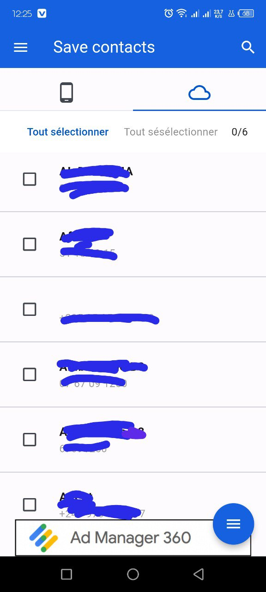

<h1>Save Contact</h1>

<h3>Description</h3>
Save Contact est une application de sauvegarde de contacts conçue pour vous aider à gérer et à protéger vos informations de contact importantes. Que vous ayez un smartphone personnel ou professionnel, cette application vous permet de sauvegarder facilement vos contacts sur une plateforme sécurisée, de les restaurer en cas de perte de données et de les synchroniser sur plusieurs appareils. Avec une interface conviviale et des fonctionnalités robustes, Save Contact simplifie la gestion de vos contacts et garantit que vos informations essentielles sont toujours accessibles.

## Captures d'écran

<h3>Page de connexion</h3>

<h3>Page d'inscription</h3>

<h3>Page d'acceuil Contact local</h3>

<h3>Page d'acceuil Contact cloud</h3>

<h3>Page de modififcation de mot de passe</h3>

<h3>Licence</h3>

Ce projet est sous licence MIT - voir le fichier <a href="LICENSE">LICENSE</a> pour plus de détails.

